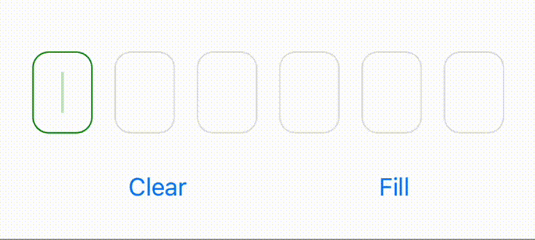
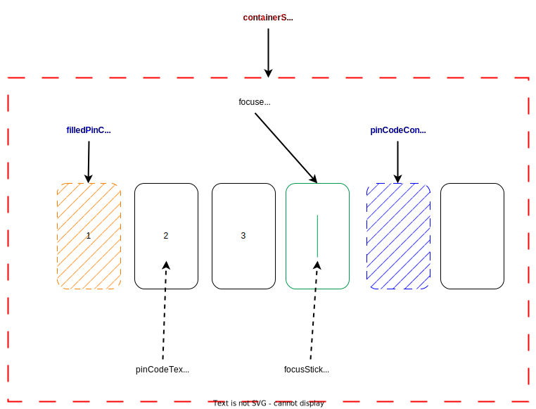

# react-native-otp-entry

[](https://badge.fury.io/js/react-native-otp-entry)
[]()
[](https://packagephobia.com/result?p=react-native-otp-entry)
[](https://github.com/anday013/react-native-otp-entry/actions)
[](https://github.com/your-username/react-native-otp-entry/blob/main/LICENSE)

`react-native-otp-entry` is a simple and highly customizable React Native component for entering OTP (One-Time Password) on iOS, Android, and Web. It provides an intuitive and user-friendly interface for inputting one-time passwords in your React Native applications.

> **Looking for a Phone Number input component?** Check out [react-native-phone-entry](https://github.com/anday013/react-native-phone-entry) - a simple and fully modifiable Phone Number Input Component for React Native that provides an intuitive interface for entering and validating international phone numbers.



## Features

- Simple and easy-to-use OTP input component.
- Highly customizable appearance and styling.
- Supports autofill
- Effortlessly integrates with **React Native**, **Expo**, and **React Native Web** platforms.
- Fully typed with TypeScript.
- Fully covered with unit tests.
- Paste functionality.

## Demo

Try out React Native OTP Entry in action on Snack Expo:

[](https://snack.expo.dev/@anday013/demo-react-native-otp-entry)

or https://snack.expo.dev/@anday013/demo-react-native-otp-entry

## Installation

Install `react-native-otp-entry` using npm or yarn:

```bash
npm install react-native-otp-entry

# or

yarn add react-native-otp-entry
```

## Usage

1. Import the `OtpInput` component from `react-native-otp-entry`:

   ```javascript
   import { OtpInput } from "react-native-otp-entry";
   ```

2. Render the `OtpInput` component in your screen/component:

   ```jsx
   <OtpInput numberOfDigits={6} onTextChange={(text) => console.log(text)} />
   ```

3. Customize the styling as per your requirements:

   ```javascript
   <OtpInput
     numberOfDigits={6}
     focusColor="green"
     autoFocus={false}
     hideStick={true}
     placeholder="******"
     blurOnFilled={true}
     disabled={false}
     type="numeric"
     secureTextEntry={false}
     focusStickBlinkingDuration={500}
     onFocus={() => console.log("Focused")}
     onBlur={() => console.log("Blurred")}
     onTextChange={(text) => console.log(text)}
     onFilled={(text) => console.log(`OTP is ${text}`)}
     textInputProps={{
       accessibilityLabel: "One-Time Password",
     }}
     textProps={{
       accessibilityRole: "text",
       accessibilityLabel: "OTP digit",
       allowFontScaling: false,
     }}
     theme={{
       containerStyle: styles.container,
       pinCodeContainerStyle: styles.pinCodeContainer,
       pinCodeTextStyle: styles.pinCodeText,
       focusStickStyle: styles.focusStick,
       focusedPinCodeContainerStyle: styles.activePinCodeContainer,
       placeholderTextStyle: styles.placeholderText,
       filledPinCodeContainerStyle: styles.filledPinCodeContainer,
       disabledPinCodeContainerStyle: styles.disabledPinCodeContainer,
     }}
   />
   ```

## Props

The `react-native-otp-entry` component accepts the following props:

| Prop                         | Type                                   | Description                                                                                                    |
| ---------------------------- | -------------------------------------- | -------------------------------------------------------------------------------------------------------------- |
| `numberOfDigits`             | number                                 | The number of digits to be displayed in the OTP entry.                                                         |
| `theme`                      | Theme                                  | Custom styles for each element. (See below)                                                                    |
| `textInputProps`             | TextInputProps                         | Extra props passed to underlying hidden TextInput (see: <https://reactnative.dev/docs/textinput>)              |
| `textProps`                  | TextProps                              | Props passed to the Text component that renders each digit (see: <https://reactnative.dev/docs/text>)          |
| `autoFocus`                  | boolean                                | _Default: true_. Sets autofocus.                                                                               |
| `focusColor`                 | ColorValue                             | The color of the input field border and stick when it is focused.                                              |
| `placeholder`                | string                                 | Placeholder value to the input.                                                                                |
| `onTextChange`               | (text: string) => void                 | A callback function is invoked when the OTP text changes. It receives the updated text as an argument.         |
| `onFilled`                   | (text: string) => void                 | A callback function is invoked when the OTP input is fully filled. It receives a full otp code as an argument. |
| `blurOnFilled`               | boolean                                | _Default: false_. Blurs (unfocuses) the input when the OTP input is fully filled.                              |
| `hideStick`                  | boolean                                | _Default: false_. Hides cursor of the focused input.                                                           |
| `focusStickBlinkingDuration` | number                                 | The duration (in milliseconds) for the focus stick to blink.                                                   |
| `disabled`                   | boolean                                | _Default: false_. Disables the input                                                                           |
| `type`                       | 'alpha' \| 'numeric' \| 'alphanumeric' | The type of input. 'alpha': letters only, 'numeric': numbers only, 'alphanumeric': letters or numbers.         |
| `secureTextEntry`            | boolean                                | _Default: false_. Obscures the text entered so that sensitive text like PIN stay secure.                       |
| `onFocus`                    | () => void                             | A callback function is invoked when the OTP input is focused.                                                  |
| `onBlur`                     | () => void                             | A callback function is invoked when the OTP input is blurred.                                                  |

| Theme                           | Type      | Description                                                                           |
| ------------------------------- | --------- | ------------------------------------------------------------------------------------- |
| `containerStyle`                | ViewStyle | Custom styles for the root `View`.                                                    |
| `pinCodeContainerStyle`         | ViewStyle | Custom styles for the container that wraps each individual digit in the OTP entry.    |
| `pinCodeTextStyle`              | TextStyle | Custom styles for the text within each individual digit in the OTP entry.             |
| `placeholderTextStyle`          | TextStyle | Custom styles for the placeholder text within each individual digit in the OTP entry. |
| `focusStickStyle`               | ViewStyle | Custom styles for the focus stick, which indicates the focused input field.           |
| `focusedPinCodeContainerStyle`  | ViewStyle | Custom styles for the input field when it is focused.                                 |
| `filledPinCodeContainerStyle`   | ViewStyle | Custom styles for the input field when it has a value.                                |
| `disabledPinCodeContainerStyle` | ViewStyle | Custom styles for the input field when it is disabled.                                |

**Note:** The `ViewStyle` and `TextStyle` types are imported from `react-native` and represent the style objects used in React Native for views and text, respectively.

**Tip:** If you have difficulties while applying `gap` or in any other style property to set a suitable space between the OTP input containers, please set the `width` in `containerStyle` to `'auto'` or `undefined`, as it is been set to `'100%'` by default.



## Ref

The `react-native-otp-entry` component exposes these functions with `ref`:

| Prop       | Type                     | Description                        |
| ---------- | ------------------------ | ---------------------------------- |
| `clear`    | () => void;              | Clears the value of the OTP input. |
| `focus`    | () => void;              | Focus of the OTP input.            |
| `setValue` | (value: string) => void; | Sets the value of the OTP input.   |

## License

This project is licensed under the [MIT License](https://github.com/your-username/react-native-otp-entry/blob/main/LICENSE).

## Contributing

Contributions are welcome! Please feel free to open issues or submit pull requests.

If you find a bug or have any feature requests, please open an issue :)

## Support Me

If you find this project helpful and want to support my work, consider buying me a coffee! ☕

[](https://www.buymeacoffee.com/anday013)
